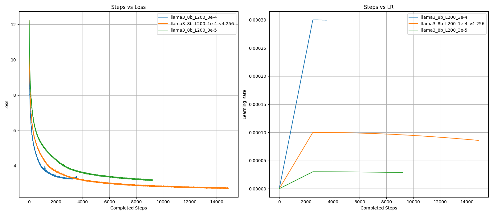

# MaxText Modified

This is a modified version of MaxText for my personal training use. The features I plan to add and have added will be listed below.  
For the native README of MaxText see [README_ORIGINAL.md](README_ORIGINAL.md).

## Implementation Roadmap
- [x] add mak-number-of-checkpoints support
- [ ] add wandb logging to MaxText
- [x] add orbax lm-eval-harness adapter
- [deprecated] add a checker and doc to verify the consistency between Huggingface and ORBAX format.

## Max Number of Checkpoints Support
MaxText does not natively support limiting the number of checkpoints to save (i.e., deleting the older ones and only keep the last `k` checkpoints). This branch supports this features by adding [this line](https://github.com/Zephyr271828/maxtext/blob/0ac88df254f6d4ae1da377a1549e29309223f878/MaxText/checkpointing.py#L86).  
In order to use this feature, you can simply add `checkpoint_max_to_keep=` to your config. You may refer to the [base config](https://github.com/Zephyr271828/maxtext/blob/0ac88df254f6d4ae1da377a1549e29309223f878/MaxText/configs/base.yml#L49).

## ORBAX Adapter
Before you check, make sure you have initialized the submodules:
```bash
git submodule update --init --recursive
```
Then, see `lm-evaluationn-harness/lm_eval/models/orbax_lm.py` for the adapter class. See `lm-evaluation-harness/scripts/test_orbax_eval.py` for an example of using the adapter for evaluation.  

Results I obtained on Llama-3.1-8B:
| Format | C4 | WikiText | WikiText2 | cnn_dailymail | Winogrande | ARC-C | Hellaswag(acc) | Hellaswag(acc-norm) | 
|:--:|:--:|:--:|:--:|:--:|:--:|:--:|:--:|:--:|
| HF | 9.916 | 5.81 | 5.773 | 7.075 | 73.95 | 51.45 | 59.97 | 78.76 |
| ORBAX | 9.918 | 5.811 | 5.775 | 7.077 | 74.19 | 51.71 | 60.67 | 79.39 | 

**Caveat:** currently the efficiency of this implementation is not completely satisfactory, as it may take 2-4 times longer to evaluate on a v4-8 TPU compared to evaluating on 1 A100 TPU. I'm currently investigating solution to this issue.

## Pretraining Llama-3.1-8B
Currently Taiming Lu and I plan to pretrain Llama-3-8B together. Below are some records for verification:

### Training Recipe
Following the original recipe of training Llama-3-8B, we adopt:
| Max LR | Min LR Ratio | Seq Len | Global BS | LR Decay | Warmup Ratio | Warmup Schedule |
|:--:|:--:|:--:|:--:|:--:|:--:|:--:|
| 3e-4 | 0.1 | 8192 | 512 | cosine | 0.01 | linear |

However, later we noticed maxLR=3e-4 causes instability in training. After some tuning of the max LR, we decided to **change the maxLR to 1e-4** and keep everything else the same.


### Training Data
We plan to use [DCLM-Baseline-1.0](https://huggingface.co/datasets/mlfoundations/dclm-baseline-1.0). The [leaderboard](https://github.com/mlfoundations/dclm?tab=readme-ov-file#leaderboard) showcased the effectiveness of using DCLM to pretrain model.  
In order to train on MaxText with DCLM, I 
1. download the raw `jsonl.zst` files from huggingface.
2. decompress to `.jsonl` files.
3. convert each `.jsonl` file to an `.array_record` file.
See my scripts at `gs://llm_pruning_us_central2_b/datasets/dclm/scripts/{download.py, jsonl2arrayrecord.py}` for verification. You can also check an example of jsonl file at `gs://llm_pruning_us_central2_b/datasets/dclm/dclm_baseline/dclm_baseline_1.0.chunk.00000.jsonl`

### Training Script
Check my training script at [`pretrain/llama3_8b_L200_1e-4.sh`](pretrain/llama3_8b_L200_1e-4.sh).

### Other Modifications
I haev modified `multihost_runner.py` to make it work in my docker environment. To see the original version, see [`multihost_runner_orig.py`](multihost_runner_orig.py).

